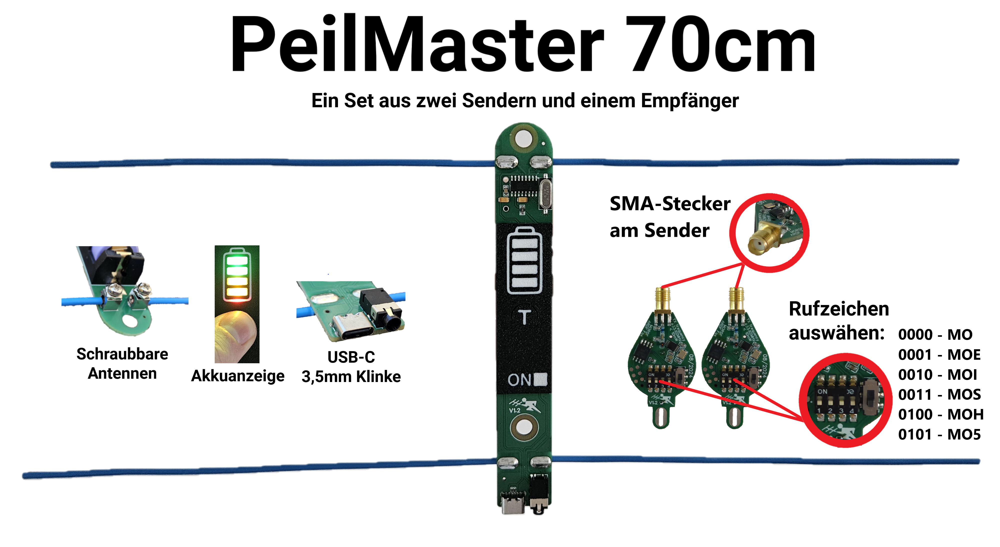
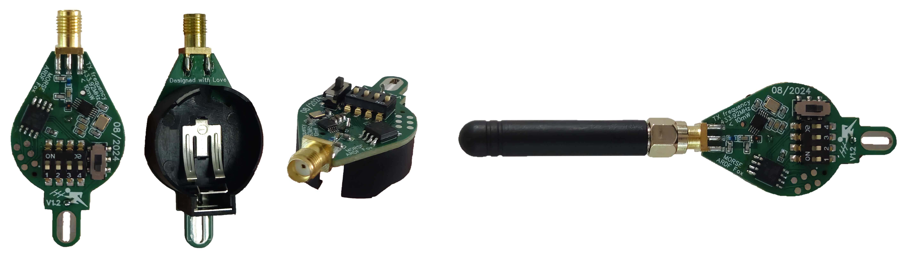

# PeilMaster: Der Professionelle 70 cm Funkpeilempfänger

 

PeilMaster ist ein robustes, leicht zu bedienendes Peilsystem für Funkenthusiasten und Anfänger im Bereich der Funksignalortung oder ARDF Fuchsjagt. Das Set enthält einen 70 cm Funkpeilempfänger sowie zwei vielseitige Sender, perfekt für den Einsatz bei Peilübungen und Fuchsjagden.

---

## Hauptfunktionen

- **Modularer Aufbau:** Schraubbare SMA-Antennen am Sender und Schraubklemmen am Empfänger für den Anschluss von Dipol Dräthe.
- **Eingebaute Akkuanzeige und USB-C-Ladeanschluss:** Der Empfänger wird von einem langlebigen 18650-Akku versorgt und bietet eine ausdauernde Betriebszeit.
- **Automatisches Einschalten:** Aktivierung des Empfängers durch Einstecken eines 3,5 mm Klinkenkabels.
- **Frequenzbereich:** Sender und Empfänger arbeiten auf dem 70 cm Band, ideal für Peilübungen.
- **Sender mit größerer Reichweite:** Der Sender ist mit einem MicRF112Y-Modul ausgestattet und bietet bis zu 10 mW Sendeleistung.
- **Rufzeichen Konfigurierbar** Dip-Schalter ermöglichen die binäre Konfiguration der Rufzeichen (MO bis MO5) für Füchse.
- **Energiequelle des Senders:** CR2477-Knopfzelle, die leicht gewechselt werden kann.

---

## Haupteinsatzbereiche

Der PeilMaster ist ideal für:
- **Fuchsjagden und Peilübungen** – Für Anfänger und Fortgeschrittene in der Funkpeilung.
- **Trainingsübungen** – Zur Verbesserung der Ortungsfähigkeiten im Amateurfunkbereich.

Das Set bietet eine solide Ausstattung zu einem günstigen Preis und eignet sich daher ideal als Einsteigerpaket.

---

## Erwerb des PeilMaster-Sets

Dieses Set kann direkt bei mir erworben werden. Kontaktiere mich bitte via Mail: 
**E-Mail:** [DO1MA@WEB.DE](mailto:DO1MA@WEB.DE)
---

## Hardware-Beschreibung

### Empfänger

- **Chip:** Basierend auf dem SYN470R-Chip, einem kostengünstigen 433 MHz IMS-Chip, der einfach zu beschaffen ist. Der Einsatz dieses Chips ermöglicht einen unkomplizierten Aufbau des Parallel-Sender-Sets.
- **Stromversorgung:** Wiederaufladbarer 18650-Akku, aufladbar über USB-C.
- **Energieverwaltung:** Automatisches Einschalten beim Verbinden des 3,5 mm Klinkensteckers.
- **Status-LEDs:** Der Empfänger ist mit drei Status-LEDs ausgestattet, die je nach Zustand verschiedene Farben anzeigen:
  - **Ladevorgang:** 
    - **Rot:** Der Akku wird gerade geladen.
    - **Grün:** Der Akku ist vollständig geladen.
  - **Betriebsstatus:** 
    - **Blau:** Zeigt an, dass der Empfänger aktiv ist und ein Audiosignal über die Kopfhörerbuchse ausgegeben wird. Diese Anzeige wird aktiviert, sobald ein 3,5 mm Klinkenkabel eingesteckt wird.
- **Antenne:** In der Grundausstattung ist der Peilempfänger mit einem **Dipol** und einem **Reflektor** ausgestattet. Der Dipol ist insgesamt 32,5 cm lang, aufgeteilt in zwei Hälften von jeweils 16,25 cm. Der Reflektor hat eine Gesamtlänge von 35 cm und besteht aus zwei Hälften von je 17,5 cm. Das Design ist modular und kann auf einen externen Boom montiert werden, um zusätzliche Direktoren hinzuzufügen, was die Richtwirkung des Empfängers erheblich verbessert und die Peilgenauigkeit steigert.
- **Anschlüsse:** Ausgestattet mit Schraubklemmen für den Anschluss von Dipol Dräthen, die eine einfache und stabile Verbindung ermöglichen.
- **Gehäuse:** Robustes Design mit leicht zugänglicher Akkuanzeige (Taster "T" in der Mitte drücken) und praktischen, schraubbaren Antennen.
  
### Sender

 

- **Modul:** Basierend auf dem MicRF112Y.
- **Sendeleistung:** 10 mW.
- **Anschlüsse:** SMA-Stecker, der den Anschluss einer externen Antenne ermöglicht.
- **Stromversorgung:** CR2477-Knopfzelle, die bequem über einen Halter auf der Rückseite gewechselt werden kann.
- **Rufzeichenkonfiguration:** Der Sender kann über die Dip-Schalter in binärer Form auf verschiedene Rufzeichen eingestellt werden.

 Hier eine Übersicht der möglichen Einstellungen:

| Binäre Eingabe | Rufzeichen |
|----------------|------------|
| `0000`         | MO         |
| `0001`         | MOE        |
| `0010`         | MOI        |
| `0011`         | MOS        |
| `0100`         | MOH        |
| `0101`         | MO5        |

---

## Technische Informationen

| Komponente         | Spezifikation                                          |
|--------------------|--------------------------------------------------------|
| Empfänger          | SYN470R-Chip (433 MHz), 18650-Akku, USB-C-Aufladung   |
| Antenne (Empfänger) | Dipol (32,5 cm Gesamtlänge, geteilt in 2 x 16,25 cm) und Reflektor (35 cm Gesamtlänge, geteilt in 2 x 17,5 cm); modular erweiterbar mit Direktoren auf externem Boom |
| Sender             | MicRF112Y, 10 mW, SMA-Anschluss, Dip-Schalter          |
| Anschlüsse         | SMA-Stecker (Sender), Schraubklemmen für Dipol und Reflektor (Empfänger) |
| Akkulaufzeit       | Extrem langlebig dank 18650 Akku und sparsamer Sender  |
| Abmessungen        | Kompakte Bauweise, leicht transportierbar              |

---

## Anleitung zur Verwendung

1. **Aufbau und Vorbereitung:**
   - Schraube die SMA-Antennen an den Sender und befestige die D-Polt-Räte an den Schraubklemmen des Empfängers.
   - Stelle sicher, dass der 18650-Akku geladen ist (Empfänger) und die CR2477-Knopfzelle (Sender) eingelegt ist.
   
2. **Empfänger aktivieren:**
   - Schließe den 3,5 mm Klinkenstecker an, um den Empfänger einzuschalten. Die blaue LED zeigt, dass das Audiosignal aktiv ist.

3. **Sender konfigurieren:**
   - Wähle das gewünschte Rufzeichen über die Dip-Schalter aus, gemäß der obigen Tabelle.
   
---

## Kontakt und Support

Falls du Fragen oder Feedback zum PeilMaster hast oder das Set erwerben möchtest, erreichst du mich unter:

- **E-Mail:** [DO1MA@WEB.DE](mailto:DO1MA@WEB.DE)
- **Website:** [PeilMaster-Website](https://github.com/MarvinRzok/Peilmaster)

---

